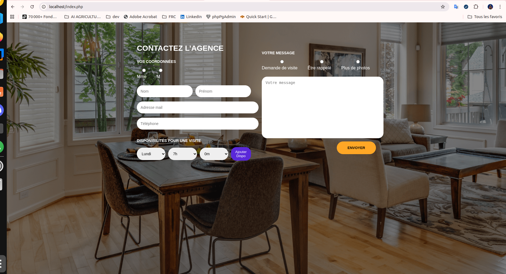

# 🚀 Test Développeur Web – Tremplin  
Projet réalisé pour Majordhom

## 👤 À propos de moi
**Nom :** BEN AJIBA  
**Prénom :** Ihsane  
**Niveau d’étude :** Bac+5
**Durée du stage souhaitée :**6 mois
**Technos maîtrisées :** Angular , spring boot , react ,vue js , .... 

---

## 📸 Aperçu du projet


Exemple Markdown :




## ⚙️ Démarrer l’environnement du projet

### 1️⃣ Cloner le repository
```bash
git clone https://github.com/ihsanben01/TEST-TREMPLINE.git
cd TEST-TREMPLIN

Lancer l’environnement Docker

Assurez-vous d’avoir Docker + Docker Compose installés.
docker-compose up -d

### Importer les tables MySQL
Depuis phpMyAdmin → Importer → choisir `sql/schema.sql`

Structure du projet
/
├── docker/
│   └── Dockerfile.php
├── www/
│   ├── index.php
│   ├── submit.php
│   ├── style.css
│   └── images/
      └── salon.png
├── docker-compose.yml
└── Capture d'écran.png
└── README.md


❓ Réponses aux questions
🔹 Avez-vous trouvé l’exercice facile ou difficile ?

L’exercice était globalement accessible, 

🔹 Difficultés rencontrées

Reproduction exacte de la maquette.

Configuration du lien PHP ↔ MySQL dans Docker.

🔹 Nouveaux outils appris ?

Oui, notamment :

LAMP sous Docker

Utilisation propre de mysqli avec prepared statements

🔹 Pourquoi ces outils ?

Docker : environnement rapide, reproductible, identique à celui demandé.

PHP/MySQL : stack fournie par le test.

Vanilla JavaScript : suffisant pour gérer les disponibilités.

🔹 Avez-vous utilisé la stack proposée ?

Oui, intégralement :

Apache

PHP 

MySQL 

phpMyAdmin

🔹 Utilisez-vous régulièrement Docker ?

Oui,je l'ai déjà utilisé dans des projets académiques et j’en connais les fondamentaux.